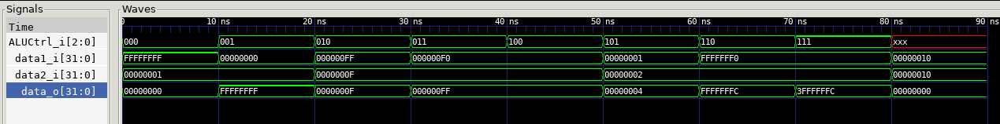
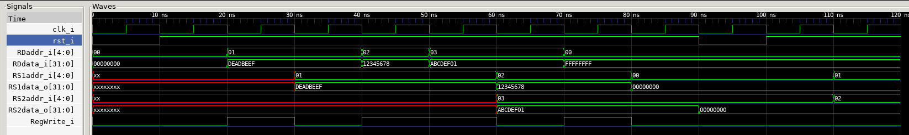

# CA2024 Programming hw3  
**B08902150 謝騏鴻**  

## 1. A description of each module’s design.  

ALU：讀取兩個 32-bit 的輸入，並根據 ALUControl 的結果，做運算，除非是是 register 沒東西，就輸出 zero  。

其中，shift left都是補 0，但是shift right會有正負號的問題，不能都補0，所以分成Arithmetic,Logical.  

Register：去讀取RS1addr_i、RS2addr_i位址的資料，再接著把這兩個寫進目標暫存器，以便後續操作此兩暫存器、做運算。
```
注意以下細節:  
當 rst_i = 0 時，所有輸出的資料信號（如 RS1data_o 和 RS2data_o）都應為零。  
當 rst_i 從低（0）拉高（1）後，暫存器開始正常工作。  
RegWrite_i：寫入啟用信號，只有在高電平（1）時，RDdata_i 的值應被寫入 RDaddr_i 指定的暫存器。  
RS1data_o、RS2data_o：應該對應 RS1addr_i 和 RS2addr_i 指定暫存器的值。
```

## 2. A description of your testing process:  

測試ALU步驟： 
```
iverilog -o ALU_test ALU.v ALU_tb.v  
```
```
vvp ALU_test  
```
輸入 finish
```
gtkwave ALU_test.vcd  
```
可以看到每個i/o的變化

因為我的測資不多，用眼睛看檢查16進位的運算的結果，判斷程式有無正確執行

特殊情況：  
0xFFFFFFFF+1 的結果應該為 0x00000000。  
0x00000000−1 的結果應該為 0xFFFFFFFF。  




測試Register步驟：
```
iverilog -o Registers_test Registers.v Registers_tb.v  
```
```
vvp Registers_test  
```
輸入finish
```
gtkwave Registers_test.vcd  
```  


